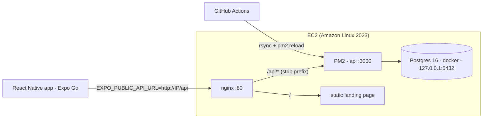
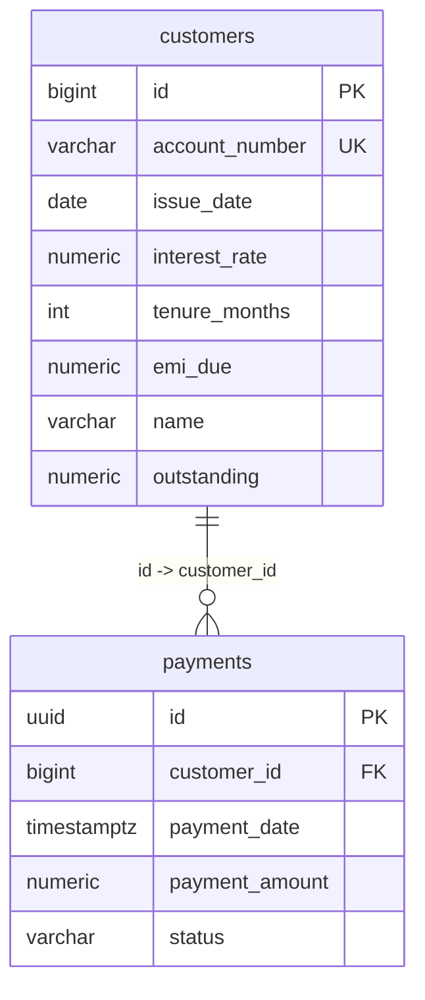

# Architecture Spine — Payment Collection App (Coligo)

## Design Paradigm

**API:** layered monolith — `routes → services → repositories`. Routes own HTTP (parse, validate, status codes); services own business rules; repositories own SQL. No SQL above the repository layer; no HTTP concerns below routes.

**Mobile:** thin client — `screens (components/hooks) → services/api-client → shared types`. Screens never `fetch` directly; all HTTP goes through `apps/mobile/src/services/api.ts`. Components + services separation is an explicit requirement — this layering is the deliverable.

## Invariants & Rules

### AD-1 — Mandated REST contract is frozen
- **Binds:** FR-6, FR-7, FR-8, apps/api routes, nginx
- **Prevents:** route drift from the required endpoints
- **Rule:** Express serves the mandated paths at root: `GET /customers`, `POST /payments`, `GET /payments/:account_number`, plus documented conveniences `GET /customers/:account_number` (single-loan lookup) and `GET /health`. nginx exposes the same handlers under `/api/*` (prefix stripped via `proxy_pass http://127.0.0.1:3000/;`); the mobile app always calls `EXPO_PUBLIC_API_URL` (`http://<host>/api`).

### AD-2 — Shared contract package is the single source of truth
- **Binds:** apps/api, apps/mobile, packages/shared
- **Prevents:** two units independently defining request/response shapes that drift
- **Rule:** All request/response DTOs and zod schemas live in `packages/shared/src`; both apps import from `@coligo/shared`. No local re-declaration of API types in either app.

### AD-3 — Money and identity shapes
- **Binds:** FR-10, FR-11, packages/shared, DB
- **Prevents:** float money, inconsistent ids across units
- **Rule:** Money is `NUMERIC(12,2)` in Postgres and serialized as a JSON **number** (INR-scale demo; no sub-paise amounts accepted — zod validates ≤ 2 decimals). `customers.id` BIGSERIAL PK; `account_number` VARCHAR(20) UNIQUE NOT NULL (natural lookup key, never exposed as FK target); `payments.id` UUID (`gen_random_uuid()`) — surfaced to users as the payment reference on confirmation. Timestamps `TIMESTAMPTZ`, ISO-8601 in JSON.

### AD-4 — Payments are an insert-only ledger
- **Binds:** FR-7, FR-11, services
- **Prevents:** two state-mutation paths (ledger vs. balance updates) diverging
- **Rule:** A successful `POST /payments` is a single INSERT with status `SUCCESS` + `payment_date = now()`. No customer-row mutation in v1 (EMI due is seed-static). Unknown account → 404 before insert; validation failure → 400, nothing written.

### AD-5 — Uniform error envelope
- **Binds:** FR-9, apps/api middleware, apps/mobile error states
- **Prevents:** mixed error shapes between endpoints / platforms
- **Rule:** Every error response is `{"error":{"code":"string","message":"human-readable"}}` — 400 (zod validation), 404 (unknown account), 500 (unhandled; message generic, details server-log only, never a stack trace). Mobile renders `error.message` from this envelope.

### AD-6 — Config only via environment variables
- **Binds:** NFR-2, NFR-3, CI/CD, deployment
- **Prevents:** secrets in git; API URL hardcoding (explicit requirement)
- **Rule:** API reads `DATABASE_URL`, `PORT`, `NODE_ENV`. Mobile reads `EXPO_PUBLIC_API_URL` (Expo build-time inlining). `.env.example` committed for both; real values only in GitHub Actions secrets + server `.env`.

### AD-7 — Deployment topology is single-instance EC2, PM2 + Docker Postgres
- **Binds:** NFR-4, CI/CD
- **Prevents:** deploy-path improvisation between pushes
- **Rule:** CI (GitHub Actions, on push to `main`): pnpm install → `turbo run build test typecheck` → rsync `apps/api` build + `packages/shared` to EC2 → `pm2 reload`. Postgres 16 runs in Docker on EC2 bound to `127.0.0.1:5432` only. nginx :80 proxies `/api/` → PM2 (port 3000) and serves a static landing page at `/`. AL2023.

### AD-8 — Query path optimization is explicit
- **Binds:** DB, FR-6, FR-8 (requirement: query optimization)
- **Prevents:** unindexed scans on hot paths
- **Rule:** `GET /payments/:account_number` resolves account → id via the unique index, then one indexed query on `payments(customer_id, payment_date DESC)`. Composite index `(customer_id, payment_date)` required in the migration. `GET /customers` is a single indexed table scan with LIMIT.

## Consistency Conventions

| Concern | Convention |
| --- | --- |
| Naming | TypeScript everywhere; files kebab-case (`payment.service.ts`); zod schemas `XSchema`, inferred types `X` |
| Data & formats | Dates ISO-8601 strings in JSON; ids — account `string`, payment reference UUID string |
| Errors & logging | AD-5 envelope; API logs JSON lines (`pino`), one line per request (method, path, status, ms) |
| State | No client-side cache/state library; local `useState` + fetch service is enough at this scale |

## Stack

| Name | Version |
| --- | --- |
| Node.js | 20 (AL2023 `nodejs20`; CI `actions/setup-node@v4` node 20) |
| Package manager | pnpm 9 + Turborepo 2 |
| API | Express 5, TypeScript 5, zod, pg, pino, supertest + vitest |
| Mobile | Expo SDK 54 (blank-TS template), react-native 0.81, expo-constants |
| DB | PostgreSQL 16 (Docker) |
| CI/CD | GitHub Actions → rsync + PM2; nginx 1.24 (AL2023 dnf) |

*(Stack is seed: exact pins live in lockfiles; update this table if scaffold installs newer majors.)*

## Structural Seed

```text
payment-collection-app/
  apps/
    api/            # Express: src/{routes,services,repositories,db,middleware}
    mobile/         # Expo: app/(tabs)|src/{screens,components,services}
  packages/
    shared/         # DTO types + zod schemas (built before both apps)
  .github/workflows/ci.yml
  docker-compose.yml    # local Postgres
```





## Capability → Architecture Map

| Capability / Area | Lives in | Governed by |
| --- | --- | --- |
| Loan details UI (FR-1/2) | `apps/mobile` screens | paradigm, AD-2 |
| Payment + confirmation (FR-3/4/5) | `apps/mobile` screens + `services/api.ts` | paradigm, AD-5 |
| REST API (FR-6/7/8/9) | `apps/api` routes/services/repositories | AD-1, AD-4, AD-5 |
| Data & schema (FR-10/11/12) | `apps/api/src/db` migrations + seed | AD-3, AD-8 |
| Responsiveness (NFR-1) | mobile styling (Dimensions/StyleSheet) | conventions |
| Security (NFR-2) | zod + parameterized pg queries + AD-6 env | AD-5, AD-6 |
| CI/CD + deploy (NFR-4) | `.github/workflows`, nginx, PM2 | AD-7 |

## Deferred

- Auth/OTP — out of scope for v1; top of the production backlog.
- Payment gateway integration — simulated success only.
- Balance/next-due recalculation after payment — v2 after ledger (AD-4).
- HTTPS/domain — HTTP + Elastic IP for the demo endpoint; document Let's Encrypt path in README.
- E2E mobile tests — tsc typecheck + lint in CI only.
